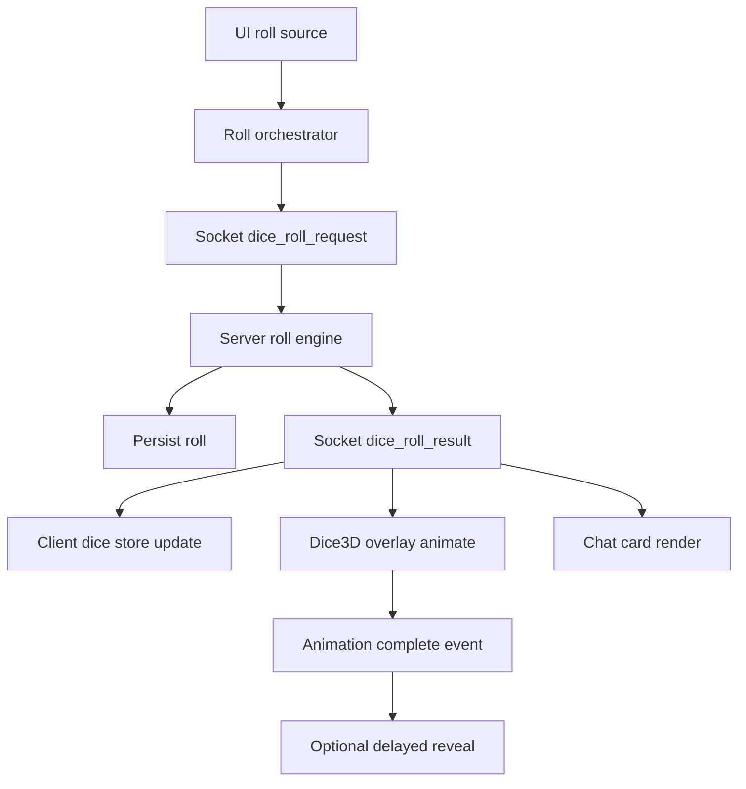

# 3D Dice System Plan for VTT

## Recommendation

Use a **Babylon.js overlay for 3D dice** while keeping **Pixi v8** as the primary VTT renderer.

This is the best-fit path for the current codebase because:

- Babylon + Havok are already in dependencies in [`client/package.json`](../client/package.json)
- It avoids forcing 3D concerns into the Pixi scene graph
- It keeps existing React panel/state architecture intact
- It allows deterministic, server-authoritative roll outcomes while still showing high-quality 3D animation

## Current Dice Surface Found

Primary roll entry points currently used:

- Main dice panel: [`DiceRoller`](../client/src/components/DiceRoller.tsx)
- Chat quick dice and slash rolls: [`ChatPanel`](../client/src/components/ChatPanel.tsx)
- Inline roll text: [`RollableText`](../client/src/components/RollableText.tsx)
- Macros roll execution: [`MacrosPanel`](../client/src/components/MacrosPanel.tsx)
- Initiative ad-hoc random roll usages in combat components

Current message sync path:

- Client emits chat payload through [`sendChatMessage`](../client/src/services/socket.ts)
- Server relays by visibility in [`chat_message handler`](../server/src/websocket/handlers.ts)
- Dice roll card parsing/rendering in [`parseDiceRollMessage`](../client/src/utils/chatRolls.ts)

## Target Architecture

### 1. New Dice Domain Layer in Client

Create a unified roll orchestration layer so all roll sources call one API:

- `requestRoll` input: formula, source, visibility, actor, optional metadata
- Returns: authoritative result payload with per-die outcomes
- Emits event to UI + overlay for animation

Planned new modules:

- `client/src/dice/types.ts`
- `client/src/dice/rollOrchestrator.ts`
- `client/src/dice/visibility.ts`
- `client/src/dice/deterministicRng.ts` optional helper

### 2. 3D Dice Overlay (Babylon in React)

Add an isolated React component mounted near top-level app:

- `client/src/components/dice3d/Dice3DOverlay.tsx`
- `client/src/components/dice3d/useDice3DEngine.ts`
- `client/src/components/dice3d/diceMeshFactory.ts`
- `client/src/components/dice3d/diceAnimationController.ts`

Behavior:

- Transparent fullscreen canvas over the board and panels
- Non-interactive by default (`pointer-events: none`) except optional user controls
- Receives resolved roll payload and animates matching dice outcomes
- Emits `animationComplete` signal so result reveal timing can be controlled

### 3. Server-Authoritative Roll Event

Add dedicated socket event pair:

- Client -> server: `dice_roll_request`
- Server -> client(s): `dice_roll_result`

Server responsibilities:

- Validate formula and command visibility
- Produce authoritative per-die results
- Persist normalized roll record
- Broadcast according to existing visibility semantics

### 4. Deterministic Sync Model

Use authoritative result-first model:

- Server computes all dice values
- Client animates toward those exact face outcomes
- Chat and history consume the same payload object

This removes desync risk between visual 3D throw and chat total.

## Event Flow

## Integration Plan by Existing Roll Source

### Dice panel

Refactor [`DiceRoller`](../client/src/components/DiceRoller.tsx) to call orchestrator instead of local random functions.

### Chat quick dice and slash rolls

Refactor [`ChatPanel`](../client/src/components/ChatPanel.tsx) roll submit path to orchestrator; keep normal text messages unchanged.

### Inline rollable text

Refactor [`RollableText`](../client/src/components/RollableText.tsx) click handler to orchestrator.

### Macros

Refactor [`MacrosPanel`](../client/src/components/MacrosPanel.tsx) roll macro path to orchestrator.

### Initiative rolls

Replace direct `Math.random` initiative calls with orchestrated roll request tagged `source: initiative`.

## Data Contract Draft

`DiceRollRequest`:

- `requestId`
- `formula`
- `visibility` public gm blind self
- `source` dicePanel chat inline macro initiative api
- `context` optional tokenId actorId ability

`DiceRollResult`:

- `requestId`
- `rollId`
- `formula`
- `dice` array with sides and individual rolls and kept flags
- `total`
- `visibility`
- `timestamp`
- `userId username`

## File-by-File Change Map

### Client

- Update [`client/src/components/DiceRoller.tsx`](../client/src/components/DiceRoller.tsx)
- Update [`client/src/components/ChatPanel.tsx`](../client/src/components/ChatPanel.tsx)
- Update [`client/src/components/RollableText.tsx`](../client/src/components/RollableText.tsx)
- Update [`client/src/components/MacrosPanel.tsx`](../client/src/components/MacrosPanel.tsx)
- Update initiative roll callsites discovered in [`client/src/components/CombatTracker.tsx`](../client/src/components/CombatTracker.tsx) and related components
- Add dice domain + overlay files under `client/src/dice/` and `client/src/components/dice3d/`
- Update store in [`client/src/store/gameStore.ts`](../client/src/store/gameStore.ts) with optional 3D dice state flags

### Server

- Extend websocket handlers in [`server/src/websocket/handlers.ts`](../server/src/websocket/handlers.ts)
- Add reusable server roll engine module
- Optionally add DB fields/table for normalized roll payload and metadata

### Shared

- Add shared socket payload types in `shared/src/` for request and result contracts

## Rollout Strategy

1. Implement orchestrator + server events behind feature flag `dice3dEnabled`
2. Keep existing 2D roll/chat path as fallback
3. Migrate one source first chat quick roller then others
4. Enable 3D animation for public rolls first then gm/blind/self
5. Remove duplicated local RNG code once all sources are migrated

## Testing Strategy

- Unit tests for formula parsing compatibility and visibility mapping
- Unit tests for request/result transformation in orchestrator
- Integration tests for socket visibility routing public gm blind self
- Multiplayer tests for same authoritative total across clients
- Visual tests for dice face-to-result correctness
- Performance checks with burst rolls low-end GPU and disabled WebGL fallback path

## Acceptance Criteria

- All roll sources produce one canonical roll result path
- 3D dice animation result always matches chat total and history
- Visibility rules remain identical to current behavior
- Pixi board interactions remain stable with overlay active
- Feature flag can disable 3D and preserve current user experience
