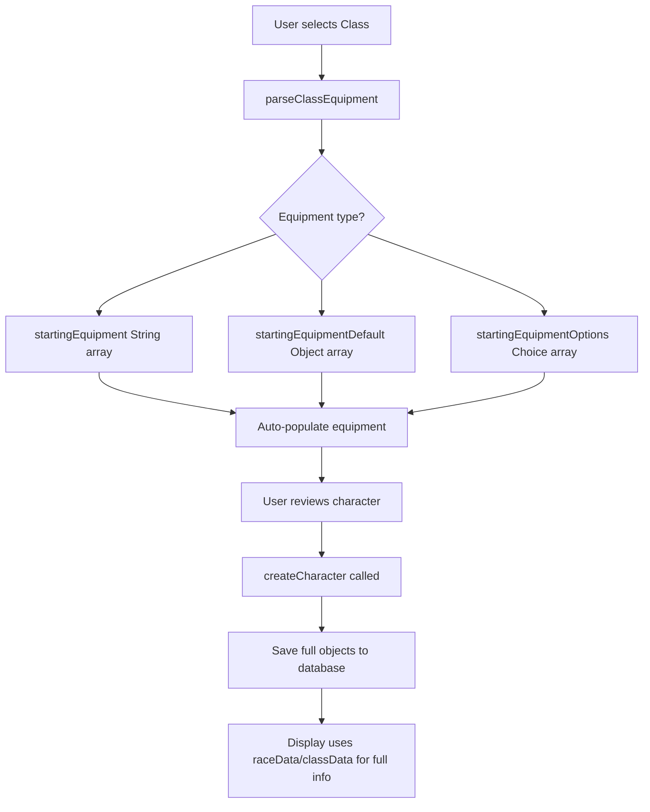

# CharacterCreatorWizard Implementation Plan

## Issues Identified

### Issue 1: Equipment from Class and Background not available

The current code only checks for `startingEquipment` (string array) but 5e.tools data has:

- `startingEquipment` - simple string array with descriptions
- `startingEquipmentOptions` - array of choices the player must make  
- `startingEquipmentDefault` - the actual equipment objects
- `startingProficiencies` - weapon/armor proficiencies

Background has `equipment` field as plain text.

### Issue 2: Only text representation stored

When creating a character, only names are stored:
```typescript
// Current - stores only names
race: characterData.race?.name || undefined,
class: characterData.class?.name || undefined,  
background: characterData.background?.name || undefined,
```

Should store full objects with id, name, and other properties.

---

## Solution Plan

### Step 1: Update CharacterSheet Interface

Add new fields to store full objects alongside the existing string fields in [`CharacterSheetPanel.tsx`](client/src/components/CharacterSheetPanel.tsx:27):

```typescript
interface CharacterSheet {
  // Existing string fields (keep for compatibility)
  race?: string;
  class?: string;
  background?: string;
  
  // NEW: Full object fields
  raceData?: { id: string; name: string; system?: any; img?: string };
  classData?: { id: string; name: string; system?: {...}; img?: string };
  backgroundData?: { id: string; name: string; system?: {...}; img?: string };
}
```

### Step 2: Update CharacterCreatorWizard State

Update the local state in [`CharacterCreatorWizard.tsx`](client/src/components/CharacterCreatorWizard.tsx:52) to track selected objects and parse equipment from class/background.

### Step 3: Enhanced Equipment Parsing

Parse class/background equipment from the 5e.tools data structure:

- Handle `startingEquipment` (simple array)
- Handle `startingEquipmentDefault` (actual objects)  
- Handle `startingEquipmentOptions` (player choices)
- Handle background equipment (text field)

### Step 4: Auto-populate Equipment on Selection

When user selects a class or background, automatically add their equipment to the equipment list.

### Step 5: Update Character Creation

Save full objects when creating character in [`createCharacter`](client/src/components/CharacterCreatorWizard.tsx:190) function.

### Step 6: Update Display (Review Step)

Show full object information in the review section instead of just names.

---

## Implementation Steps

1. **Update CharacterSheetPanel.tsx interface** - Add new fields for raceData, classData, backgroundData
2. **Update CharacterCreatorWizard.tsx state types** - Ensure proper typing for equipment objects
3. **Add equipment parsing functions** - Create helper functions to parse class/background equipment
4. **Update class selection handler** - Auto-add class equipment when selected
5. **Update background selection handler** - Auto-add background equipment when selected  
6. **Update createCharacter function** - Save full objects to the character sheet
7. **Update review step display** - Show full object information

---

## Files to Modify

| File | Changes |
|------|---------|
| `client/src/components/CharacterSheetPanel.tsx` | Add `raceData`, `classData`, `backgroundData` fields to `CharacterSheet` interface |
| `client/src/components/CharacterCreatorWizard.tsx` | Multiple changes for equipment parsing, auto-population, and saving full objects |

---

## Data Flow Diagram


