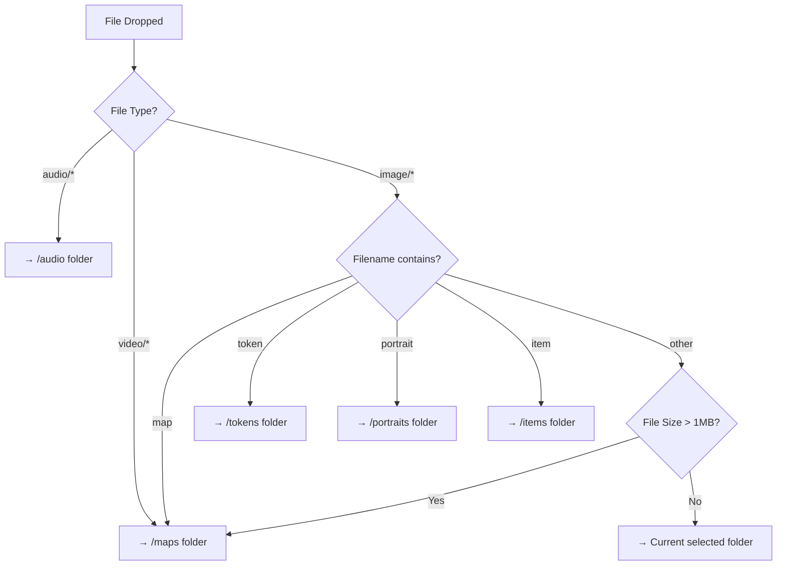

# File Upload Routing Fix Plan

## Problem

When users drag and drop files onto the canvas, all files are uploaded to the `currentPath` which defaults to `/tokens`. Audio and map files end up in the wrong folder.

## Root Cause

In `client/src/components/FileBrowser.tsx`:

1. Line 95: `currentPath` defaults to `/tokens`
2. Line 228-230: `getUploadPath()` simply returns `currentPath`
3. Line 240: `uploadFiles()` uses `getUploadPath()` to determine upload destination
4. No logic exists to detect file type and route to appropriate folder

## Solution: Tiered File Type Detection

### Proposed Logic Flow

### Detailed Routing Rules

| File Type | Detection Method | Destination Folder |
|-----------|------------------|-------------------|
| Audio | `file.type.startsWith('audio/')` or extension `.ogg`, `.mp3`, `.wav`, etc. | `/audio` |
| Video | `file.type.startsWith('video/')` | `/maps` |
| Image (map) | Filename contains "map" (case-insensitive) | `/maps` |
| Image (token) | Filename contains "token" | `/tokens` |
| Image (portrait) | Filename contains "portrait" or "avatar" | `/portraits` |
| Image (item) | Filename contains "item" | `/items` |
| Image (large) | File size > 1MB (likely a map) | `/maps` |
| Other/Default | None of above matched | Current selected folder |

### Implementation Steps

1. **Add helper function** `detectFileCategory(file: File): string` - Returns the appropriate folder ID based on type, extension, and filename

2. **Add helper function** `getFolderPathByCategory(category: string): string` - Maps category to folder path

3. **Modify `uploadFiles` function** - Before uploading, detect file category and use appropriate path

4. **Consider user experience** - Add a notification showing where files were uploaded

### Edge Cases

- **Multiple files dropped**: Use the first file's type to determine folder (or detect majority type)
- **Ambiguous filenames**: Fall back to current folder
- **User already in correct folder**: Maintain current behavior
