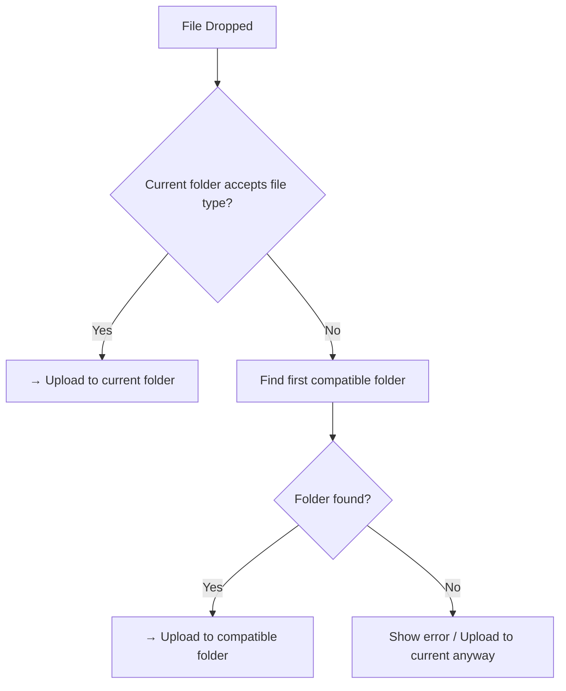

# File Upload Routing Fix Plan (v2)

## Problem

When users drag and drop files onto the canvas, all files are uploaded to the `currentPath` which defaults to `/tokens`. Audio and map files end up in the wrong folder.

## Root Cause

In `client/src/components/FileBrowser.tsx`:

1. Line 95: `currentPath` defaults to `/tokens`
2. Line 228-230: `getUploadPath()` simply returns `currentPath`
3. Line 240: `uploadFiles()` uses `getUploadPath()` to determine upload destination
4. No logic exists to check if file is compatible with current folder

## Solution: Compatible Folder Detection

### Core Logic

Only route to a different folder if the current folder doesn't accept the file type. Otherwise, use the current folder - this is the simplest solution as you suggested.



### File Type Compatibility Mapping

Each folder has an `accepts` property (from `DEFAULT_ASSET_FOLDERS`):

| Folder | Accepts |
|--------|---------|
| tokens | `image/*` |
| maps | `image/*,video/*` |
| portraits | `image/*` |
| items | `image/*` |
| audio | `audio/*` |
| handouts | `image/*,video/*,.pdf,.json,.txt` |

### Implementation Steps

1. **Add helper function** `isFileCompatibleWithFolder(file: File, accepts: string): boolean` - Check if file MIME type or extension matches folder's accepts string

2. **Add helper function** `findCompatibleFolder(file: File): AssetFolder | null` - Find first folder that accepts the file type

3. **Modify `uploadFiles` function** - Before uploading, check compatibility and route accordingly

### Compatibility Check Logic

```typescript
function isFileCompatibleWithFolder(file: File, accepts: string): boolean {
  const acceptsList = accepts.split(',').map(a => a.trim());
  
  for (const accept of acceptsList) {
    // Handle wildcard patterns like "image/*"
    if (accept.endsWith('/*')) {
      const typePrefix = accept.slice(0, -2); // "image" from "image/*"
      if (file.type.startsWith(typePrefix)) return true;
    }
    // Handle extensions like ".pdf"
    if (accept.startsWith('.')) {
      const ext = accept.toLowerCase();
      if (file.name.toLowerCase().endsWith(ext)) return true;
    }
    // Exact match
    if (file.type === accept) return true;
  }
  
  return false;
}
```

### Example Behavior

| Current Folder | Dropped File | Result |
|---------------|--------------|--------|
| `/tokens` | image.png | → `/tokens` (compatible) |
| `/tokens` | audio.ogg | → `/audio` (tokens doesn't accept audio) |
| `/audio` | audio.ogg | → `/audio` (compatible) |
| `/audio` | image.png | → `/tokens` (audio doesn't accept images) |
| `/maps` | video.mp4 | → `/maps` (compatible) |
| `/maps` | image.png | → `/maps` (compatible) |
| `/maps` | audio.ogg | → `/audio` (maps doesn't accept audio) |

### Implementation Details

- Check compatibility for the **first file** when multiple files are dropped
- If no compatible folder found, show error or upload to current folder with warning
- This is a minimal, non-disruptive change that maintains user workflow
