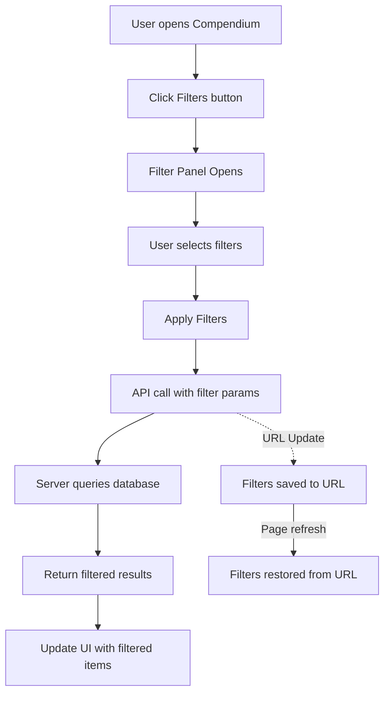

# Spell and Monster Filtering Implementation Plan

## Overview
This plan outlines the implementation of filtering capabilities for spells and monsters in the VTT compendium.

## Current State Analysis

### Database Schema

**CompendiumEntry** (main table):
- `id`, `moduleId`, `system`, `type`, `name`, `slug`, `source`, `summary`, `raw` (JSON), `createdAt`, `updatedAt`

**CompendiumSpell** (related table):
- `level`, `school`, `castingTime`, `components`, `range`, `duration`, `saveType`, `damageType`, `description`
- Additional filterable properties stored in `raw` JSON: `concentration`, `ritual`, `sourceClass`, `components` (verbal, somatic, material)

**CompendiumMonster** (related table):
- `size`, `creatureType`, `challengeRating`, `hitPoints`, `armorClass`, `alignment`, `actions`, `traits`
- Additional filterable properties stored in `raw` JSON: `speed` (movement types), `type` (creature type), `habitat` (if available)

### Existing API
- `/api/data/compendium/search` - Basic search with `q`, `type`, `system` filters only

---

## Implementation Plan

### Phase 1: Server-Side API Enhancement

#### 1.1 Extend Search Endpoint
**File**: `server/src/routes/data.ts`

Add new query parameters to `/compendium/search`:

**For Spells**:
| Parameter | Type | Description |
|-----------|------|-------------|
| `level` | number | Spell level (0-9) |
| `school` | string | Magic school (e.g., "evocation", "necromancy") |
| `sourceClass` | string | Class that can cast (e.g., "wizard", "cleric") |
| `concentration` | boolean | Requires concentration |
| `ritual` | boolean | Can be cast as ritual |
| `verbal` | boolean | Has verbal component |
| `somatic` | boolean | Has somatic component |
| `material` | boolean | Has material component |
| `source` | string | Book/source (e.g., "PHB", "XGE") |

**For Monsters**:
| Parameter | Type | Description |
|-----------|------|-------------|
| `type` | string | Creature type (e.g., "beast", "undead") |
| `crMin` | number | Minimum challenge rating |
| `crMax` | number | Maximum challenge rating |
| `size` | string | Size category (e.g., "Tiny", "Small", "Medium", "Large", "Huge", "Gargantuan") |
| `source` | string | Book/source |
| `speedFly` | boolean | Has flying speed |
| `speedSwim` | boolean | Has swimming speed |

#### 1.2 Implement Filter Logic
- Use Prisma's `where` clause with `AND` conditions
- For `raw` JSON fields, use PostgreSQL JSON operators (`->>`, `->`)
- Add proper indexes for frequently filtered fields

#### 1.3 Add Filter Options Endpoint
**New Endpoint**: `GET /api/data/compendium/filters/:type`
Returns available filter options for a given type:
- For spells: list of schools, classes, sources
- For monsters: list of types, sizes, sources

---

### Phase 2: Client-Side Filter UI

#### 2.1 Add Filter Panel Component
**File**: New component `client/src/components/FilterPanel.tsx`

Features:
- Collapsible filter sections
- Multi-select dropdowns for categorical filters
- Range sliders for numeric filters (level, CR)
- Toggle switches for boolean filters (concentration, ritual, etc.)
- "Clear All Filters" button
- Active filter count badge

#### 2.2 Integrate with Compendium Component
**File**: `client/src/components/Compendium.tsx`

Changes:
- Add filter button next to search bar
- Show active filters as chips/tags
- Persist filter state in URL query params
- Debounce filter changes to avoid excessive API calls

#### 2.3 Filter UI Mockup

```
┌─────────────────────────────────────────────────────────┐
│  🔍 Search...        [⚙ Filters] [Clear] [3 active]    │
├─────────────────────────────────────────────────────────┤
│  Type: [All] [Spell] [Monster] [Item] [Feat] ...       │
├─────────────────────────────────────────────────────────┤
│  FILTERS                              [×]              │
│  ┌─────────────────────────────────────────────────────┐│
│  │ Level Range: [0]──────────────[9]                  ││
│  │                                                     ││
│  │ School:  [▼ Select...                    ]         ││
│  │    □ Evocation  □ Necromancy  □ Illusion  ...     ││
│  │                                                     ││
│  │ Class:   [▼ Select...                    ]         ││
│  │    □ Wizard  □ Cleric  □ Druid  □ Sorcerer  ...   ││
│  │                                                     ││
│  │ Source:  [▼ Select...                    ]         ││
│  │    □ PHB  □ XGE  □ TCE  □ DMG                   ││
│  │                                                     ││
│  │ Properties:                                         ││
│  │    [✓] Concentration  [ ] Ritual                   ││
│  │    [✓] Verbal  [✓] Somatic  [ ] Material          ││
│  │                                                     ││
│  │ [Apply Filters]  [Reset]                           ││
│  └─────────────────────────────────────────────────────┘│
└─────────────────────────────────────────────────────────┘
```

---

### Phase 3: Data Model Updates (Optional)

If the required filter fields are not in the database:

#### 3.1 Add New Columns to CompendiumSpell
```prisma
model CompendiumSpell {
  // ... existing fields
  concentration Boolean @default(false)
  ritual        Boolean @default(false)
  sourceClass   String?
}
```

#### 3.2 Add New Columns to CompendiumMonster  
```prisma
model CompendiumMonster {
  // ... existing fields
  speedFly      Boolean @default(false)
  speedSwim     Boolean @default(false)
  speedBurrow   Boolean @default(false)
  speedClimb    Boolean @default(false)
}
```

---

## Implementation Order

1. **Step 1**: Extend the search API endpoint to accept new filter parameters
2. **Step 2**: Add database indexes for frequently filtered fields
3. **Step 3**: Create filter options endpoint
4. **Step 4**: Build filter panel component
5. **Step 5**: Integrate with Compendium component
6. **Step 6**: Add URL persistence for filters

---

## Files to Modify

| File | Changes |
|------|---------|
| `server/src/routes/data.ts` | Add filter params to search endpoint, new filter options endpoint |
| `server/prisma/schema.prisma` | Optional: Add new columns if needed |
| `client/src/components/FilterPanel.tsx` | New: Filter panel component |
| `client/src/components/Compendium.tsx` | Add filter UI integration |
| `client/src/services/api.ts` | Add API calls for filtering |

---

## Mermaid: Filter Flow


