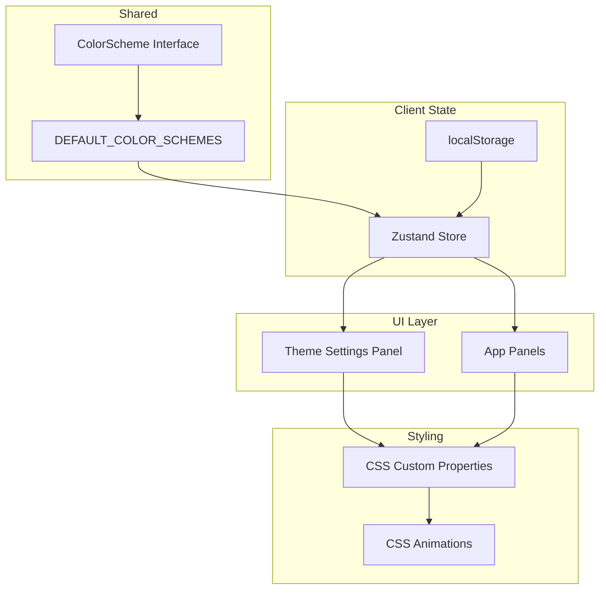

# Theming Options Enhancement Plan

## Overview

Add customizable visual theming options including panel shadows, border glows, and modern CSS effects to make the VTT look cool and personalized.

---

## Current State

The project already has:
- **Theme system**: CSS variables in `:root` and theme classes (`.theme-nord`, `.theme-dracula`, etc.)
- **Color schemes**: Defined in [`shared/src/index.ts`](shared/src/index.ts:303) with 12+ built-in themes
- **Custom color support**: Users can create custom color schemes
- **Existing effects**: Some box-shadow usage and basic glows on buttons

---

## Proposed Theming Options

### 1. Panel Shadow Customization

Add shadow intensity and color options for panels:

| Option | Type | Description |
|--------|------|-------------|
| `panelShadowIntensity` | `0-100` | Controls shadow darkness/spread |
| `panelShadowColor` | `string` | Color of the shadow (default: black) |
| `panelShadowBlur` | `number` | Blur radius in pixels |
| `panelShadowOffset` | `number` | Offset/distance from panel |
| `panelShadowSpread` | `number` | Spread radius |

**CSS Implementation:**
```css
.panel {
  box-shadow: 
    var(--panel-shadow-offset-x, 0) 
    var(--panel-shadow-offset-y, 4px) 
    var(--panel-shadow-blur, 12px) 
    var(--panel-shadow-spread, 0)
    var(--panel-shadow-color, rgba(0, 0, 0, 0.3));
}
```

---

### 2. Border Glow Effects

Add customizable glow around panels and elements:

| Option | Type | Description |
|--------|------|-------------|
| `borderGlowEnabled` | `boolean` | Enable/disable border glow |
| `borderGlowColor` | `string` | Color of the glow (typically accent color) |
| `borderGlowIntensity` | `0-100` | Intensity of the glow |
| `borderGlowRadius` | `number` | Blur radius for glow effect |
| `borderGlowAnimation` | `boolean` | Enable animated pulsing glow |

**CSS Implementation:**
```css
.panel-glow {
  position: relative;
}

.panel-glow::before {
  content: '';
  position: absolute;
  inset: -2px;
  border-radius: inherit;
  background: linear-gradient(45deg, 
    var(--glow-color), 
    transparent, 
    var(--glow-color));
  z-index: -1;
  filter: blur(var(--glow-radius, 8px));
  opacity: var(--glow-intensity, 0.5);
}

/* Animated glow */
@keyframes glow-pulse {
  0%, 100% { opacity: var(--glow-intensity, 0.5); }
  50% { opacity: calc(var(--glow-intensity, 0.5) * 1.5); }
}

.panel-glow-animated::before {
  animation: glow-pulse 2s ease-in-out infinite;
}
```

---

### 3. Glassmorphism Effects

Add modern frosted glass effect options:

| Option | Type | Description |
|--------|------|-------------|
| `glassEffectEnabled` | `boolean` | Enable glassmorphism |
| `glassOpacity` | `0-100` | Background opacity |
| `glassBlur` | `number` | Backdrop blur amount |
| `glassBorder` | `boolean` | Show subtle border |
| `glassSaturation` | `number` | Saturation boost |

**CSS Implementation:**
```css
.panel-glass {
  background: rgba(255, 255, 255, var(--glass-opacity, 0.1));
  backdrop-filter: blur(var(--glass-blur, 10px));
  -webkit-backdrop-filter: blur(var(--glass-blur, 10px));
  border: 1px solid rgba(255, 255, 255, var(--glass-border-opacity, 0.2));
}
```

---

### 4. Gradient Borders

Add gradient border options:

| Option | Type | Description |
|--------|------|-------------|
| `gradientBorderEnabled` | `boolean` | Enable gradient border |
| `gradientBorderColors` | `string[]` | Array of 2+ colors |
| `gradientBorderWidth` | `number` | Border thickness |
| `gradientBorderStyle` | `linear\|radial` | Gradient type |

**CSS Implementation:**
```css
.panel-gradient-border {
  position: relative;
  background: var(--bg-surface);
  border-radius: var(--panel-radius);
}

.panel-gradient-border::before {
  content: '';
  position: absolute;
  inset: 0;
  border-radius: inherit;
  padding: var(--gradient-border-width, 2px);
  background: linear-gradient(
    var(--gradient-angle, 45deg), 
    var(--gradient-color-1), 
    var(--gradient-color-2)
  );
  -webkit-mask: 
    linear-gradient(#fff 0 0) content-box, 
    linear-gradient(#fff 0 0);
  mask: 
    linear-gradient(#fff 0 0) content-box, 
    linear-gradient(#fff 0 0);
  -webkit-mask-composite: xor;
  mask-composite: exclude;
}
```

---

### 5. Neon Accent Effects

Add neon-style glow on interactive elements:

| Option | Type | Description |
|--------|------|-------------|
| `neonEnabled` | `boolean` | Enable neon effect |
| `neonColor` | `string` | Neon glow color |
| `neonIntensity` | `0-100` | Glow intensity |
| `neonAnimation` | `boolean` | Flicker animation |

---

### 6. Backdrop Blur Overlay

For modals and overlays:

| Option | Type | Description |
|--------|------|-------------|
| `overlayBlur` | `number` | Blur amount for modal backdrop |
| `overlayDim` | `0-100` | Dim level (opacity) |

---

## Implementation Steps

### Phase 1: Data Structure

1. **Update ColorScheme interface** in [`shared/src/index.ts`](shared/src/index.ts:288)
   - Add new theming fields for shadows, glows, glass effects
   - Add presets for common configurations

2. **Update DEFAULT_COLOR_SCHEMES**
   - Add default shadow/glow values to each theme
   - Ensure backwards compatibility

### Phase 2: State Management

3. **Update gameStore** in [`client/src/store/gameStore.ts`](client/src/store/gameStore.ts:1)
   - Add new theming options to state
   - Add persistence (localStorage)

### Phase 3: CSS Variables

4. **Update App.css** in [`client/src/App.css`](client/src/App.css:23)
   - Add new CSS custom properties
   - Create utility classes for effects
   - Add animation keyframes

### Phase 4: UI Components

5. **Create Theme Settings Panel**
   - Add to ProfilePanel or create new panel
   - Sliders for shadow/glow intensity
   - Color pickers for colors
   - Toggle switches for effects

6. **Apply effects to panels**
   - ChatPanel, TokenPanel, DiceRoller, etc.
   - Use CSS classes or inline styles

### Phase 5: Persistence

7. **Save/Load settings**
   - Store in localStorage
   - Sync with server (optional)

---

## Architecture Diagram



---

## Cool CSS Tricks to Implement

### 1. Smooth Hover Transitions
```css
.panel {
  transition: transform 0.2s ease, box-shadow 0.2s ease, border-color 0.2s ease;
}

.panel:hover {
  transform: translateY(-2px);
  box-shadow: 0 8px 25px var(--shadow-color);
}
```

### 2. Gradient Text (for headers)
```css
.gradient-text {
  background: linear-gradient(90deg, var(--accent), var(--accent-secondary));
  -webkit-background-clip: text;
  -webkit-text-fill-color: transparent;
}
```

### 3. Animated Border (running gradient)
```css
@keyframes border-dance {
  from { background-position: 0% 50%; }
  to { background-position: 100% 50%; }
}

.panel-animated-border {
  background: linear-gradient(90deg, var(--color1), var(--color2), var(--color1));
  background-size: 200% 100%;
  animation: border-dance 3s linear infinite;
}
```

### 4. Noise/Texture Overlay
```css
.panel-textured::after {
  content: '';
  position: absolute;
  inset: 0;
  background-image: url('/noise.png');
  opacity: 0.03;
  pointer-events: none;
}
```

---

## Preset Theme Styles

Create preset configurations for quick selection:

| Preset | Description |
|--------|-------------|
| `minimal` | Subtle shadows, no glows |
| `default` | Balanced shadows with soft glow |
| `neon` | Bright accent glows, dark background |
| `glass` | Glassmorphism effect |
| `cyberpunk` | Strong neon glows, gradient borders |
| `rpg` | Warm, parchment-like with soft shadows |

---

## Files to Modify

1. **shared/src/index.ts** - Add theming interface fields
2. **client/src/store/gameStore.ts** - Add state and persistence
3. **client/src/App.css** - Add CSS variables and effects
4. **client/src/App.tsx** - Apply theme styles
5. **client/src/components/ProfilePanel.tsx** - Add theme settings UI

---

## Questions for User

1. **Priority**: Which effects are most important to you?
   - Shadow customization
   - Border glows
   - Glassmorphism
   - Animated effects

2. **UI Location**: Where should the theme settings be?
   - Profile panel
   - Toolbar dropdown
   - Separate settings modal

3. **Complexity**: Should we start simple (sliders) or go advanced (presets + full customization)?

4. **Persistence**: Should settings sync across devices via server, or just localStorage?
